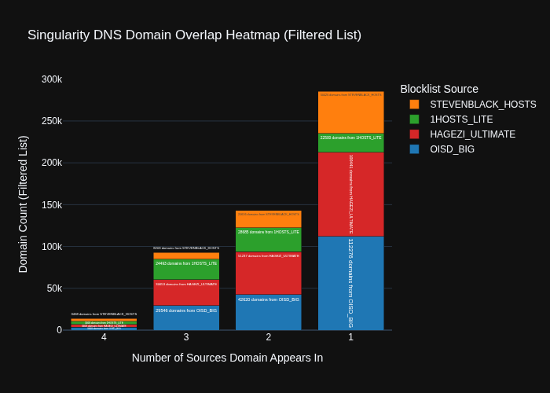

# 🛡️ Singularity DNS Blocklist Dashboard
*Generated: 2025-11-25 22:22:21*

## 🔑 Summary Metrics
| Metric | Count | Trend |
| :--- | :--- | :--- |
| Priority List Count | **300,000** | `+0` ➡️ |
| Total Unique Domains (Pre-filter) | 451,887 | |
| Domains Excluded by TLD Filter | 60,232 | |
| Total Filtered Domains (Post-filter) | 391,655 | |
| Domains Unique to 1 Source | 285,643 | |

## ⚖️ Scoring Weights
| Source | Weight | Color |
| :--- | :---: | :--- |
| **1HOSTS_LITE** | 3 | ███ |
| **HAGEZI_ULTIMATE** | 4 | ███ |
| **OISD_BIG** | 2 | ███ |
| **STEVENBLACK_HOSTS** | 1 | ███ |

## 🔥 Interactive Stacked Domain Overlap Dashboard
The full interactive dashboard is available at: [`dashboard.html`](dashboard.html)

### Static Preview
