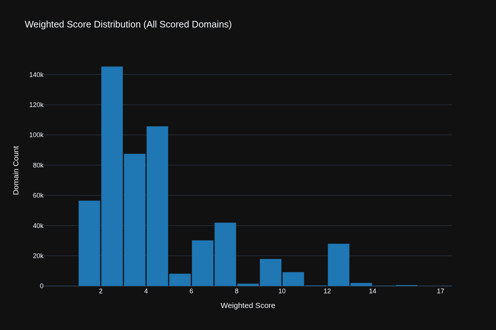

# 🛡️ Singularity DNS Blocklist Dashboard
*Generated: 2025-11-26 03:42:03*

## 📜 Historical Trends
| Metric | Count | 7-Day Trend |
| :--- | :--- | :--- |
| **Total Unique Domains** | **534,614** | `-1` ⬇️ &nbsp; **█** |
| **Trend Window** | 2025-11-26 to 2025-11-26 | |

## 🔑 Summary Metrics
| Metric | Count | Details |
| :--- | :--- | :--- |
| Domains with **High Consensus (Score 9+)** | 46,398 | Highest consensus domains. |
| Domains Excluded by TLD Filter| 66,078 | TLD filter efficacy metric. |
| Priority List Size | 300,000 | Capped domains selected from full list. |

---

## 🌐 Source Performance & Contribution
| Source | Weight | Total Fetched | In Priority List | % Contributed | Unique to Source | Color |
| :--- | :---: | :---: | :---: | :---: | :---: | :--- |
| **HAGEZI_ULTIMATE** | 4 | 232,365 | 186,087 | 100.0% | 89,061 | ███ |
| **1HOSTS_LITE** | 3 | 92,483 | 79,145 | 100.0% | 19,108 | ███ |
| **ADGUARD_BASE** | 3 | 119,145 | 98,635 | 100.0% | 41,733 | ███ |
| **OISD_BIG** | 2 | 215,381 | 99,178 | 52.8% | 109,585 | ███ |
| **ANUDEEP_ADSERVERS** | 2 | 42,348 | 7,045 | 16.8% | 34,929 | ███ |
| **ADAWAY_HOSTS** | 2 | 6,540 | 6,488 | 99.8% | 10 | ███ |
| **STEVENBLACK_HOSTS** | 1 | 97,120 | 37,732 | 45.6% | 44,977 | ███ |

---

## 🤝 Domain Overlap Breakdown
Detailed count of how many domains in the filtered list appeared in multiple sources.
| Overlap Level (Sources) | Domains (Count) | % of Filtered List |
| :---: | :---: | :---: |
| **7** | 110 | 0.0% |
| **6** | 686 | 0.1% |
| **5** | 2,494 | 0.5% |
| **4** | 21,525 | 4.6% |
| **3** | 31,351 | 6.7% |
| **2** | 72,967 | 15.6% |
| **1** | 339,403 | 72.4% |

---

## 📈 Interactive Visualization
The full interactive dashboard is available at: [`dashboard.html`](dashboard.html)

### Static Preview
